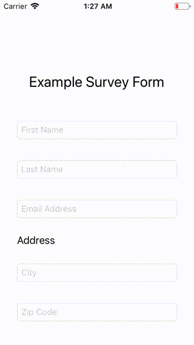

# RxKeyboardAvoidingScrollableView

  

A universal drop-in UIScrollView based solution that keeps active textfield visible when keyboard is being shown.

## Usage

- Create a UIScrollView as your top level view and add all your other views as subviews. Assign `RxKeyboardAvoidingScrollableView` to the scrollview's class in your storyboard.
- You can also create `RxKeyboardAvoidingScrollableView` programatically. Just remember to keep it as your top level view.

## Installation

- **Using [CocoaPods](https://cocoapods.org/)**:
  `pod "RxKeyboardAvoidingScrollableView"`

- **Using [Carthage](https://github.com/Carthage/Carthage)**:
  `github "ameytavkar/RxKeyboardAvoidingScrollableView" ~> 1.0.0`

## Dependencies

- [RxSwift](https://github.com/ReactiveX/RxSwift) (>= 4.4.0)
- [RxCocoa](https://github.com/ReactiveX/RxSwift) (>= 4.4.0)

## Requirements

- Swift 5.0
- iOS 9.1+

## Contributing

In development, RxKeyboardAvoidingScrollableView manages dependencies with Carthage. Use the command below in order to build the dependencies. Note that the dependecies are added as git submodules in the `.xcworkspace`.

`make setup-dependencies`

# License

RxKeyboardAvoidingScrollView is under [MIT license](http://opensource.org/licenses/MIT). See LICENSE for details.
